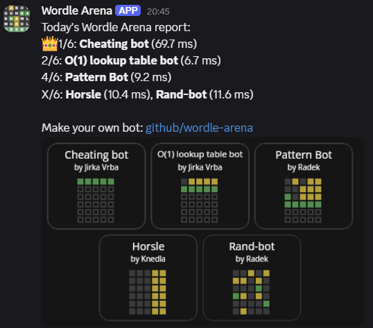

# Wordle Bot Arena



Make your fancy schmancy wordle guessing bot and battle it out in this Wordle (not associated in any way) Arena. >:)  

## Bots

[Create your own solver bot](./docs/CREATE_BOT.md).

- [Random Bot](./src/bots/randomBot/README.md)
- [Cheating Bot](./src/bots/cheatingBot/README.md)
- [Horsle](./src/bots/horsleBot/README.md)
- [Pattern Bot](./src/bots/patternBot/README.md)
- [O(1) lookup table bot](./src/bots/lookupTableBot/README.md)

## Contents

- [Wordle Bot Arena](#wordle-bot-arena)
  - [Bots](#bots)
  - [Contents](#contents)
  - [Prerequisites](#prerequisites)
  - [Setup](#setup)
  - [Run](#run)
  - [Credits](#credits)

## Prerequisites

- Node ^24

## Setup

Add your `./webhooks.json` file like:
```json
[
  "https://discord.com/api/webhooks/..."
]
```
This is to send the results to discord.
If missing, app works just fine :).

Install node packages.
```bash
npm install
```

## Run

Start a single arena battle of today.

```bash
npm run start
```

Start battles every day at 8 AM.

```bash
npm run cron
```

## Credits

- Wordle List - [gist.github.com/dracos/valid-wordle-words.txt](https://gist.github.com/dracos/dd0668f281e685bad51479e5acaadb93)
- Daily Solution - [www.nytimes.com](https://www.nytimes.com/svc/wordle/v2/2026-06-13.json)